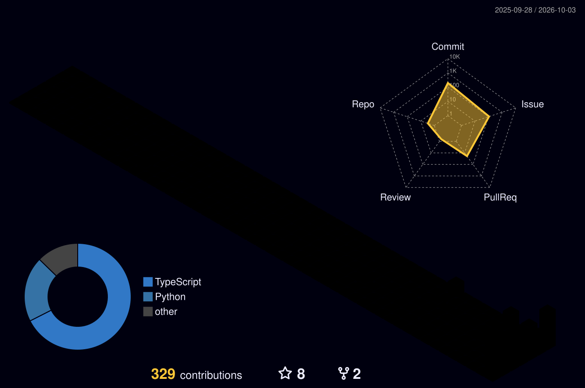

<div align="center">


# Omar Ismail

**Backend · APIs · Systems Integration · Enterprise Software**

Augsburg, Germany

<br/>

<a href="https://linkedin.com/in/omar-medhat-74930321a/">
  
</a>
<a href="https://telinage.com">
  
</a>


</div>

<br/>

> I like building the parts users don't see:
> backends, APIs, integrations, databases and infrastructure.

<br/>

## ◈ Stack

<div align="center">


<br/><br/>

`REST` &nbsp; `OAuth2` &nbsp; `OIDC` &nbsp; `OData` &nbsp; `SAP BTP` &nbsp; `CAP` &nbsp; `Integration Suite` &nbsp; `Cloud Foundry`

</div>

<br/>

---

## ◈ GitHub in 3D

<div align="center">



</div>

---

<table>
<tr>
<td width="50%" valign="top">

### ◈ Code Activity


</td>

<td width="50%" valign="top">

### ◈ Current Focus

<br/>

```text
BACKEND
├─ Java
├─ Python
├─ REST APIs
└─ PostgreSQL

INTEGRATION
├─ OAuth2 / OIDC
├─ OData
└─ System Integration

ENTERPRISE
├─ SAP BTP
├─ CAP
├─ Integration Suite
└─ Cloud Foundry
