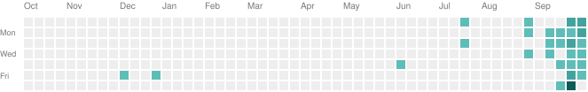

 

 

## About

<table>
<tr>

<td width="62%" valign="top">

Hi, I'm Omar. I study International Information Systems at TH Augsburg and work part-time as a developer at Telinage. Most of my work is on the backend side: APIs, connecting systems that weren't built to talk to each other, and keeping our servers running.

Long term I want to go into SAP BTP and integration, so that's what most of my side projects are about right now. I also do some Java algorithm practice every day to get better at the basics.

|  |  |
|:--|:--|
| **Work** | Working Student IT Developer, Telinage GmbH |
| **Study** | B.Sc. International Information Systems, TH Augsburg |
| **Learning** | SAP BTP, CAP, Integration Suite, OAuth2, Cloud Foundry |
| **Languages** | Arabic (native), English (fluent), German (B2, working on C1) |
| **Open to** | Working student roles and my 20-week placement, ideally in SAP integration or backend |

</td>

<td width="38%" valign="middle" align="center">

 

<a href="https://telinage.com">
   
  <b>Telinage GmbH</b>
</a>

  

<a href="https://www.tha.de">
   
  <b>TH Augsburg</b>
</a>

</td>

</tr>
</table>

 

## Kurzprofil (Deutsch)

Ich bin Werkstudent als IT-Entwickler bei der Telinage GmbH in Augsburg und studiere International Information Systems (B.Sc.) an der TH Augsburg. Im Job arbeite ich an Webanwendungen, internen Tools, REST-APIs und am Serverbetrieb. Langfristig möchte ich mich auf SAP BTP und Systemintegration spezialisieren. Für mein Praxissemester (20 Wochen) suche ich eine Stelle im Bereich SAP-Integration oder Backend-Entwicklung.

 

## Education

<table>
<tr>

<td width="140" align="center" valign="middle">

  

</td>

<td valign="top">

### B.Sc. International Information Systems

**Technische Hochschule Augsburg**, Faculty of Computer Science

Taught in English. It's a mix of computer science and business, with a lot of focus on enterprise systems and how companies actually run their processes. Includes a 20-week placement and a bachelor thesis.

**Modules I'm most interested in**

`Programming and Software Engineering` `Database Systems` `Implementation of Enterprise Systems`

`Programming of Enterprise Systems` `Business Process Modelling` `Applied AI` `Data Analytics`

</td>

</tr>
</table>

 

## What I'm doing right now

<table>
<tr>

<td width="50%" valign="top">

**At Telinage**

<ul>
<li>Building and maintaining our web apps and internal tools</li>
<li>Server admin and deployments</li>
<li>REST APIs and connecting our systems</li>
</ul>

</td>

<td width="50%" valign="top">

**On my own time**

<ul>
<li>Database design and enterprise systems</li>
<li>SAP CAP and Integration Suite</li>
<li>OAuth2, OIDC and Cloud Foundry</li>
</ul>

</td>

</tr>
</table>

 

## Technologies

**Use regularly**

  

  

**Learning**

  

  

Plus SAP BTP, SAP CAP, Integration Suite, REST and OData, Postman

  

**Used before, mostly computer vision and ML**

  

 

## Projects

<table>
<tr>

<td width="50%" valign="top">

### [Supplier Management API](https://github.com/OmarMed21/supplier-management-api)

A REST service for supplier master data. I'm building it as the base for a bigger CAP and Integration Suite setup later on.

</td>

<td width="50%" valign="top">

### [Integration Playground](https://github.com/OmarMed21/integration-playground)

Where I try out integration flows, OAuth2 and hybrid connectivity on SAP BTP. Messy on purpose, it's for learning.

</td>

</tr>
</table>

 

## Activity

  

  

Includes private work. Updates every few hours.

 

## Plans

<b>Certifications</b>

 

| Year | Certification | Status |
|:--|:--|:--|
| **2026** | telc Deutsch B2 | `in progress` |
| **2027** | SAP Integration Developer, SAP BTP Administration, SAP CAP | `planned` |
| **2028** | telc Deutsch C1, SAP Business Process Integration | `planned` |
| **2029** | SAP S/4HANA Sourcing and Procurement, ABAP Cloud (RAP) | `planned` |

<b>Reading list</b>

 

| | |
|:--|:--|
| **Reading now** | The Linux Command Line, SAP S/4HANA: An Introduction |
| **Next up** | SQL Antipatterns, Effective Java |
| **2027** | Enterprise Integration Patterns, Designing Data-Intensive Applications |

 

 

